# Network-Traffic-Analysis-with-Wireshark
A write up on my journey to understand how to analyse network traffic with packet sniffers. Mainly wireshark

# Objective
The objective of this project was to help me understand packet analysis and to document my understanding of how to use packet sniffers (mainly wireshark) to detect possible malicious activity on a network. I will first do a write up breaking down the wireshark GUI and packet analysis and then I will then document a analysis of a malicous pcap file sourced from www.malware-traffic-analysis.net.

# Introduction

In this project I have ran wireshark within my Kali Linux VM as wireshark comes preinstalled with this disto and I like to keep my cybersecurity work seperate from my host machine. 

To start we open up wireshark and are greated with this screen below

This screen is where we choose the perameters of the packet capture ("pcap") before we start the capture. Here we can choose which network interface that the pcap will capture traffic from and we can also apply filters to the pcap. some filters include
<ul>
  <li>"host" = will capture traffic for a specific ip address, both outgoing and incoming/li>
  <li>"net" = will capture traffic on a specific subnet</li></li>
  <li>"port" = captures traffic on specitic ports, you can also filter this further by adding "tcp" or "udp" before port to filter through those specific protocols </li>
  <li>"either host" = captures traffic for specific hosts through their mac address instead of their ip</li>
</ul>

you can even combine filters with the terms,"and","or" and "not" to get very specific results on the pcap.
For example.

(host 192.168.1.1 and not port 22) will only capture traffic from the host 192.168.1.1 but ignore any traffic coming through on port 22.

# Breaking down The Wireshark GUI

For this exercise I will first create a pcap file with no filters applied on the eth0 network interface.
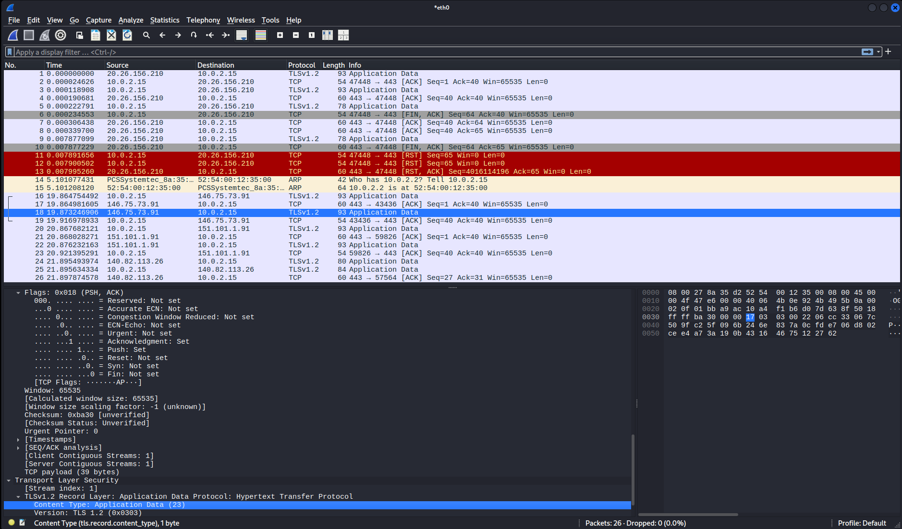

To create this traffic on the network I did some google searches on my VM(note that this would not capture any devices connected to the network as this would only apply to my machine's ethernet connection and I don't have wireshark in promiscuous mode).

Breaking this pcap down is easy, first we have the columns of the wireshark gui, they go as follows.
<ul>
  <li>No. = the order of the packets, the newer the packet the higher the number</li>
  <li>Time = The time when the packet was captured on the pcap file, measured in seconds by default but can be changed under the view menu.</li>
  <li>Source = the source address of the packet, where it came from</li>
  <li>Destination = the destination address of the packet, where it's going </li>
  <li>Protocol = the protocol the packet used</li>
  <li>Length = The total size of the packet, measured in bytes</li>
  <li>Info = short summary of the packets data. Can be helpful for filtering or for quick analysis</li>
</ul>

You will also notice that wireshark also colour codes the packets, this is to help us to quickly differentiate between network traffic types and can help us spot errors. The default ones that come preloaded as as follows.
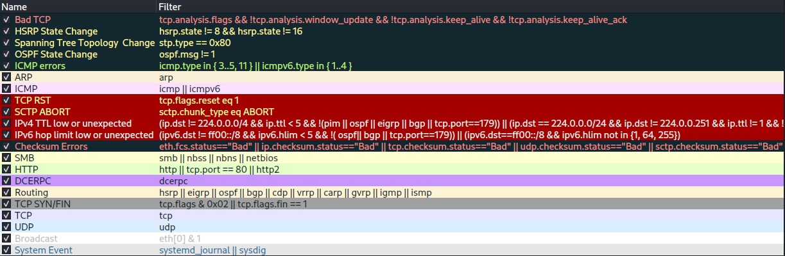

Wireshark can also let you add your own custom rules and colour code them, this is important for analysists as it can quickly highlight specific behaviours and allow faster response times.

# Breaking down a packet

With wireshark we can open up packets by double clicking on one to analyse them a little deeper. For this section I made a second pcap file where my VM opened youtube and I've used some filters to narrow down the packets.

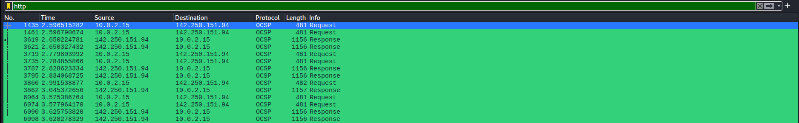

This has been filtered to show any packets using the http protocol, because youtube is a secured website (HTTPS) we cannot view any data here, the OCSP packets is where the certificate is validated from the website

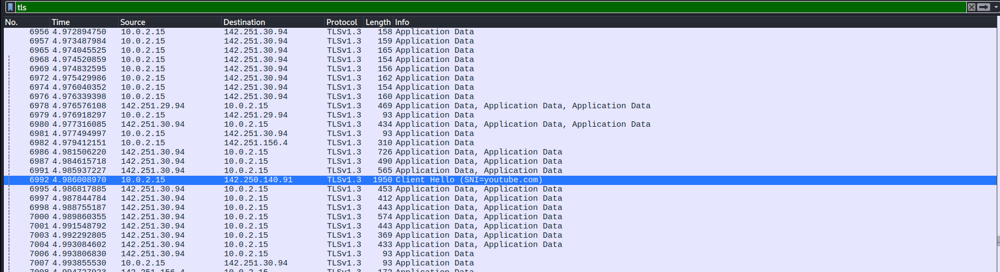

This screenshot shows the packets being filtered for the TLS protocol, this data is encrypted and cannot be viewed unless you have a method of decryption which isn't relivent to this project so I won't document this here. But you can get an idea of searches from packets that contain handshake protocols like the highlighted packet.

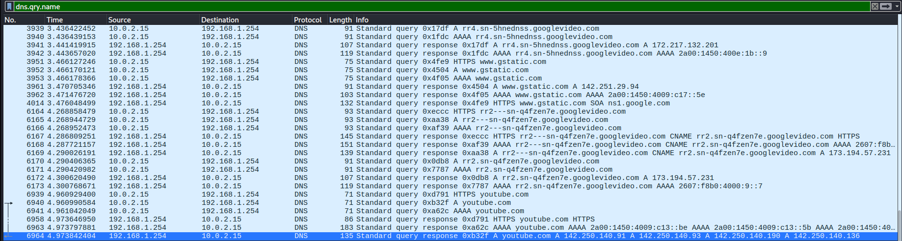

This shows the packets being filtered for DNS protocol, here you can get a rough idea of what the target was searching for from the names that appear in the response packets.

For this part I will open a packet from the DNS filters as there it'll be simple to break down compared to TLS.
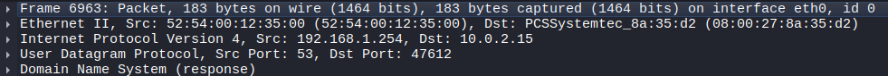

Here is the packet broken down, its a bit overwhelming but we can break this down a little
<ul>
  <li>Frame = information relating to the packet </li>
  <li>Ethernet II = information about how the frame traveled through the ethernet connection from the router</li>
  <li>Internet Protocol Version 4 = information about how the packet traveled over IPv4</li>
  <li>User Datagram Protocol = information about how the packet traveled through the UPD protocol</li>
  <li>Domain Name System = information in the packet about the DNS</li>
</ul>
Below I will also break down important information about each of these sections as there is alot here that isn't as important for an analyist in most situations.

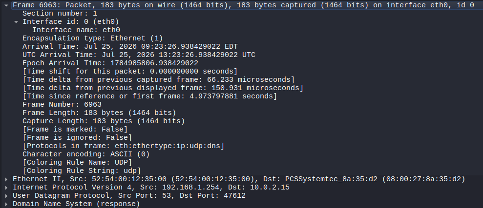

Within this section contains information relating to the packet's frame, here the important information to keep in mind are as follows

<ul>
  <li>Arrival Time = The time when the packet arrived to its destination, goes as Month, Day, Year, Hour, Minute, Second.</li>
  <li>Frame Length = The size of the frame</li>
  <li>Protocols in frame = Contains the protocols used in the packet.</li>
</ul>

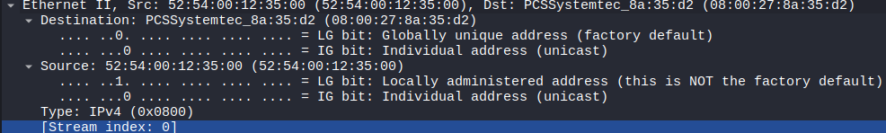

Within the Ethernet section this will display information pertaining to the path used by the frame on the eth0 network interface. On ethernet the addresses will be the MAC addresses but if this was wlan0 it would be 

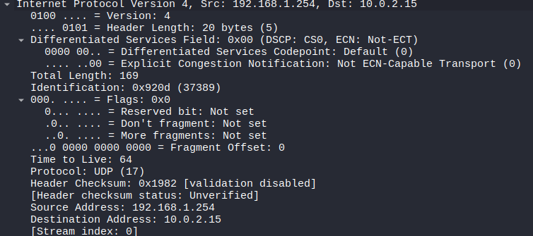

This section describes the information relating to how the packet traveled over the internet. Important parts in this section are as follows.
<ul>
  <li>Fragmentation Offset = shows if the packet has been broken up into multiple packets, the flags section helps with refragmenting the frames</li>
  <li>Time to live = The amount of time that a packet lives in a network before being dropped. Measured in how many times it passes through a router (hops) </li>
  <li>Protocol = the protocol used in the frame, in this one it is UDP</li>
  <li>Source/Desintation Address = the path taken by the packet</li>
</ul>

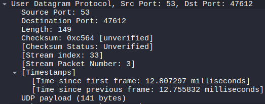

This section contains information about the User Datagram Protocol, the main parts that help us are the source port and the destination port.

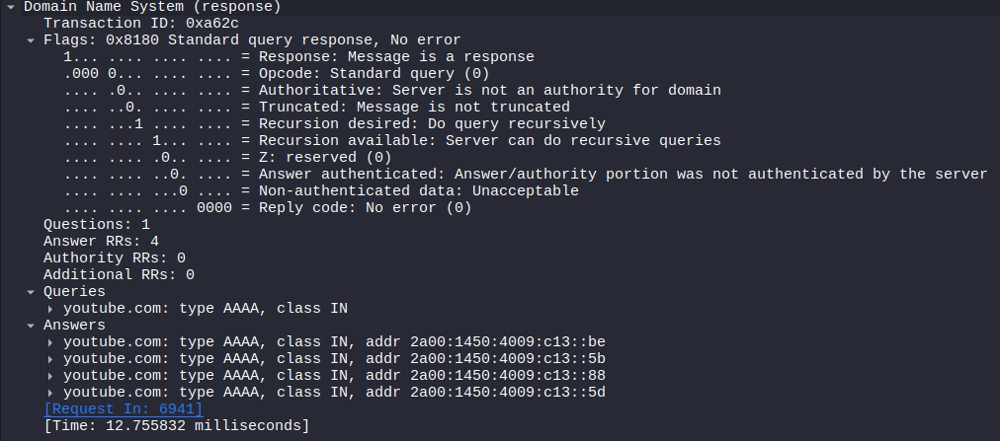

This part of the frame contains the information of the packet, referred to as the body. as you can see within this frame is the response to the request for the "youtube.com" domain back in packet 6941.

Now I will showcase some packet analysis of some malicous activity on a network. This pcap was sourced from <a href="https://www.malware-traffic-analysis.net/2024/07/30/index.html">This exercise </a>found on Malware-Traffic-Analysis.net

# Packet Analysis Write Up
